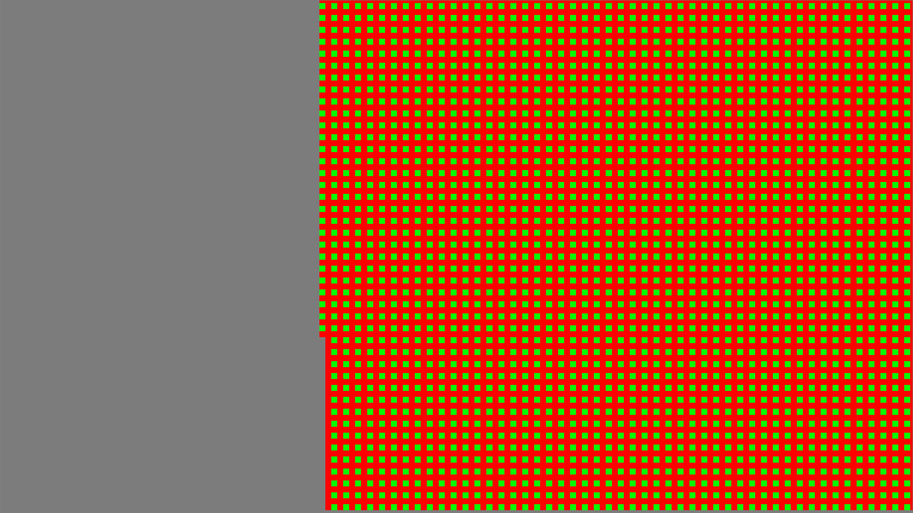

This is an experiment with various patterns in rust to try to make something that resembles a game.

Progress
--------

*2016-02-27* First version in exclusively SDL. The plan at this point was many virtual windows to function as viewports into another view frame.

The orange square is a single character, which moves randomly at each tick

*2016-02-27* Added close and resize events, although there is no visual indicator of this.

*2016-03-01* Added a vsplit view frame that had two children frames, and a menu frame that split horizontally and contained many buttons. It was around this point that I realized my ambitions were greater than SDL's built-in rendering toolkit. This screenshot ran around 10 FPS.

*2016-03-10* After some research, I decided that I would have to write the application using OpenGL, and that I was probably better off using a pre-existing virtual window library. I selected imgui, which already has maintained rust bindings. This is the first screenshot where the program worked as intended.

*2016-03-11* I'd never used OpenGL before this point. I was struggling to get the shaders working properly, and struggling with coodrinate positioning. This was the first working render.

*2016-03-11* After I got it rendering a grid, I decided to full screen the window (4k) and see what it did. The screenshot didn't capture properly. Probably something to do with the fact that frames took several seconds to render. Still, great success.

*2016-03-11* After rendering the grid, I decided to hook it back up to the actual map generator and storage backend.

*2016-03-12* I realized that I was suffering some significant frame lag. I went in search and found out that the map thread was sometimes accidentally holding up the render. I fixed that pipeline and was back up to steady 60.

*2016-03-12* I added back in the renderer for the character's position. It was at this point I decided I couldn't keep using solid colors and needed some textures.

*2016-03-13* I tried loading a texture at runtime... and that broke something in imgui-rs. (It's fixed now)[https://github.com/Gekkio/imgui-rs/issues/17], but at the time, I had to come up with a workaround. I decided to load all textures into memory before initializing imgui-rs.

*2016-03-14* I loaded all textures into memory before imgui. Alpha wasn't working properly, but I did see a measurable FPS increase. Not sure why.

*2016-03-14* I decided to upgrade the menus and implemented time controls. I also began fixing part of the transparency issue, but hadn't finished it yet.

*2016-03-15* Still avoiding transparency issues, I decided to implement a basic input event system. I passed through clicks to the map engine to replace the clicked tiles. The positioning was a bit off, but that got fixed shortly after.

*2016-03-16* Finally decided to tackle the transparency issue, and upgraded my human from the 'missing' texture to a texture that would put truly the best designers to shame.

*2016-03-17* Upgrades to the input system. Clicks are contextual. This screenshot shows a click on a human, and an inspector popping up to give more details abou the entity.

*2016-03-18* Upgrade to the rendering system wherein if you have focused on a given human, it no longer renders the map as it actually exists, but from the memory of that human. In addtion, humans no longer move randomly, but instead randomly select a point, and use dijkstra to move there.

This is actually an area that rust shines in. (Dijkstra was already implemented on anything that can be represented as a graph)[http://docs.piston.rs/conrod/petgraph/algo/fn.dijkstra.html]. All I had to do was make my MapMemory struct satisfy Graphlike, and the algorithm just worked.

Put a grey overlay on top of tiles that came from that human's memory and have not been seen this tick.
